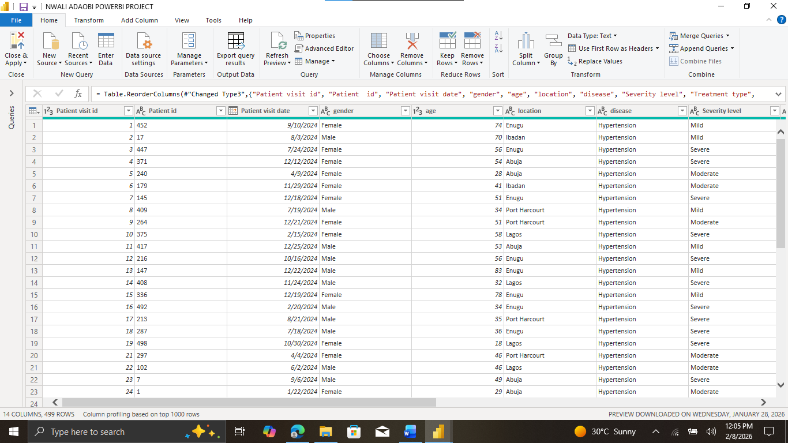
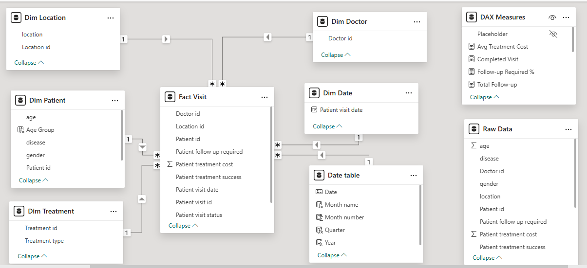
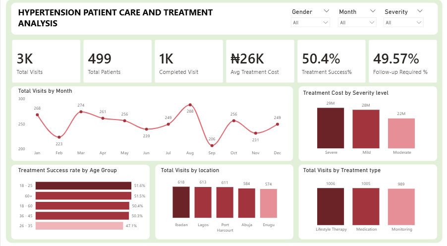

# HYPERTENSION-PATIENT-CARE-AND-TREATMENT

## Introduction
Hypertension is one of the leading risk factors of cardiovascular diseases worldwide and remains a major public health concern. Effective patient care and treatment management are essential in reducing complications such as stroke, heart failure and kidney disease. This project focuses on analyzing a one-year patient information including treatment adherence, follow up patterns and treatment success rate, to create an interactive Power BI dashboard that can help improve patient outcomes, enhance healthcare service delivery and support hypertension management.

## Problem Statement
The Cardiology team needs to understand patients visit trend, treatment cost, follow up requirements and treatment success rate, in order to enhance healthcare service delivery. The aim of the project was to design a user-friendly dashboard to answer key questions and enable the cardiology team improve overall patient and healthcare service.

## Data Sourcing
The dataset used for the project is a fictional hypertension patient care and treatment dataset.
  1. **Source**: Internal Hypertension Patient Information
  2. **Time period**: January 2024 – December 2024
  3. **Records**: 3000 visits
  4. **Key Fields**:
      - Patient Visit ID
      - Patient ID
      - Doctor ID
      - Patient Visit Date
      - Gender
      - Age 
      - Location
      - Disease
      - Severity Level
      - Treatment Type
      - Patient Treatment Cost
      - Patient Treatment Success
      - Patient Follow-up Required
      - Patient Visit Status

 ## Data Transformation and Cleaning
 Before analysis, the raw data was prepared in Power Query for accuracy and consistency.
  1. Created a backup copy of the original dataset.
  2. Removed duplicate visits.
  3. Formatted Patient ID datatype to Text

**_View the cleaned data below_**

## Data Modelling (Power BI)
A Star schema model was built in Power BI to support efficient analysis and performance.
  1. **Fact table**
      - Fact Visit (Patient Visit ID, Patient ID, Patient Visit Date, Patient Treatment Cost, Patient Treatment Success, Patient Follow-up Required, Patient Visit Status)
  2. **Dimension table**
      - Dim Date 
      - Dim Doctor
      - Dim Location
      - Dim Patient
      - Dim Treatment
  3. **Relationship**
      - One to many relationships from each dimension table to fact visit table.
      - Data table marked as the official data table.
  
This model structure allows flexible slicing and filtering across all visuals.

**_View the data modelling below_**

## Analytics and Measures
Key DAX measures were created to monitor trends
  1. **Total Visits**
      - Total Visits = DISTINCTCOUNT('Fact Visit'[Patient visit id])
  2. **Total Patients**
      - Total Patients = DISTINCTCOUNT('Fact Visit'[Patient  id])
  3. **Completed Visits**
      - Completed Visit = CALCULATE(COUNT('Fact Visit'[Patient visit status]),'Fact Visit'[Patient visit status]="Completed")
  4. **Average Treatment Cost**
      - Avg Treatment Cost = AVERAGE('Fact Visit'[Patient treatment cost])
  5. **Follow-up Required Rate**
      - Follow-up Required % = DIVIDE([Total Follow-up Required],[Total Follow-up])
  6. **Treatment Success Rate**
      - Treatment Success% = DIVIDE([Total Successful Treatment],[Total Treatment])

## Dashboard and Visuals
Dashboard screenshots are placed here in the portfolio
The dashboard includes:
  1. **KPI Cards**:
      - Total Visits 
      - Total Patients 
      - Completed Visits
      - Average Treatment Cost 
      - Follow-up Required Rate 
      - Treatment Success Rate      
  2. **Line Chart**: 
      - Total visits by Month      
  3. **Bar Chart**: 
      - Treatment success rate by age group      
  4. **Column Chart**:
      - Treatment cost by severity level
      - Total visits by location
      - Total visits by treatment type
  5. **Slicers**: 
      - Gender
      - Month
      - Severity level
      
This layout is designed for clear review and interactive explanation.

**_View the dashboard below_**

## Insight and Findings
  1. Total Visits: 3000
  2. Total Patients: 499
  3. Completed Visits: 1000
  4. Average Treatment Cost: 26,000 
  5. Follow-up Required Rate: 49.57%
  6. Treatment Success Rate: 50:4%
     
Out of 3000 visits, 9.6% patients visited in August compared to other months, accounting for the month with the peak visit. These may equally had played a role in August accounting for the month with highest total cost.

Patients with severe hypertension account for the highest treatment ocost, 36%, even though they represent a smaller share of total visits. This suggests that early detection and the treatment at mild stages could significantly reduce overall healthcare costs.

The lowest treatment success rate was found in patients between 26 to 35 years of age. 80% scheduled for follow_up visit did not see it through, hence the low treatment success rate. This suggest that follow-ups are of great importance in treatment to reduce fatality rate.

The three treatment types used; Lifestyle therapy, monitoring and medication showed a relative success rate, hence should be continued. 

## Recommendations
Notice of Follow-up visit should be sent to patients with follow-up required status, prior to the fixed date.

Follow- up appointments should be scheduled for all patients irrespective of severity level for monitoring and treatment to avoid increase in severity level.

There should be an increase in health workers in months with increased number of visits.

Infrastructures should be set in different locations, so distance cannot be used as an excuse for missed Follow-up appointments.

## Conclusion
This Project delivered an interactive insight that gave the Cardiology team a clear and better view of the patients overview and treatment success rate. The insights generated can contribute to improving patient management strategies and enhancing the overall quality of care for individuals living with hypertension. 

Future improvement may include real time patient monitoring and predictive analytics to support early risk detection and personalized treatment planning. 

## Author
**Nwali Adaobi**

**(Data Analyst)**

